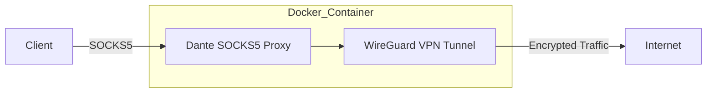

# 🛡️ Dante-WireGuard Docker Container Overview

This Docker container combines **Dante** (SOCKS5 proxy) and **WireGuard VPN** to create a secure proxy solution. 
The container runs a SOCKS5 proxy server that routes all traffic through a WireGuard VPN connection.



## Features

- SOCKS5 proxy server (Dante) running on port 1080
- WireGuard VPN integration
- Alpine Linux-based lightweight container
- Automatic IP forwarding configuration
- Debug logging enabled

## Prerequisites

- Docker installed on your system
- WireGuard configuration file (`wg0.conf`) with your VPN settings
- Docker with privileged mode support

## Quick Start

1. Build the Docker image:
```bash
docker build -t alpine-dante-wireguard .
```

2. Run the container:
```bash
docker run -d --name dante-wireguard \
    --cap-add=NET_ADMIN \
    --cap-add=SYS_MODULE \
    --privileged \
    -p 1080:1080 \
    alpine-dante-wireguard
```

## Configuration

### Dante Configuration
The default Dante configuration (`danted.conf`) is set up to:
- Listen on all interfaces (0.0.0.0) on port 1080
- Route traffic through the WireGuard interface
- Allow all incoming connections
- Log connection events

### WireGuard Configuration
Place your WireGuard configuration in `wg0.conf` before building the container. The configuration should include:
- Your private key
- Peer public key
- Allowed IPs
- Endpoint information

## Usage

Once the container is running, you can use the SOCKS5 proxy at:
```
curl --socks5-hostname <ip-host>:1080 https://ifconfig.me
```

## Security Considerations

- The container requires privileged mode and NET_ADMIN capabilities to manage network interfaces
- All traffic is routed through the WireGuard VPN
- The SOCKS proxy is configured to accept connections from any IP address

## Troubleshooting

If you encounter issues:
1. Check the container logs: `docker logs dante-wireguard`
2. Verify your WireGuard configuration
3. Ensure the container has the required capabilities
4. Check if port 1080 is available on your host system

## License

This project is open source and available under the MIT License.
